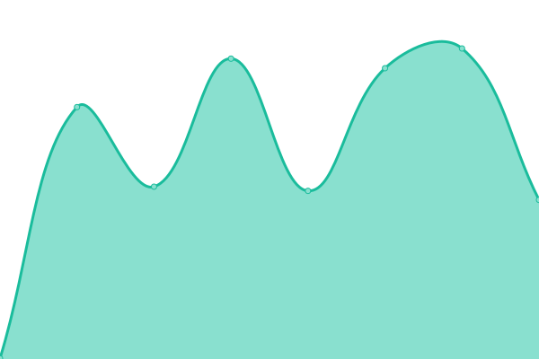

# [📈 Live Status](https://status.meetpaidly.com): <!--live status--> **🟩 All systems operational**

This repository contains the open-source uptime monitor and status page for [Upptime](https://upptime.js.org), powered by [Upptime](https://github.com/upptime/upptime).

With [Upptime](https://upptime.js.org), you can get your own unlimited and free uptime monitor and status page, powered entirely by a GitHub repository. We use [Issues](https://github.com/upptime/upptime/issues) as incident reports, [Actions](https://github.com/Paidly/upptime/actions) as uptime monitors, and [Pages](https://status.meetpaidly.com) for the status page.

<!--start: status pages-->
<!-- This summary is generated by Upptime (https://github.com/upptime/upptime) -->
<!-- Do not edit this manually, your changes will be overwritten -->
<!-- prettier-ignore -->
| URL | Status | History | Response Time | Uptime |
| --- | ------ | ------- | ------------- | ------ |
|  [Marketing Site](https://meetpaidly.com) | 🟩 Up | [marketing-site.yml](https://github.com/Paidly/upptime/commits/HEAD/history/marketing-site.yml) | 

 160ms
     
 | 

<a href="https://status.meetpaidly.com/history/marketing-site">100.00%</a>
    

|  [Web Application](https://app.meetpaidly.com) | 🟩 Up | [web-application.yml](https://github.com/Paidly/upptime/commits/HEAD/history/web-application.yml) | 

 152ms
     
 | 

<a href="https://status.meetpaidly.com/history/web-application">100.00%</a>
    

|  [Help & Support Site](https://help.meetpaidly.com) | 🟩 Up | [help-and-support-site.yml](https://github.com/Paidly/upptime/commits/HEAD/history/help-and-support-site.yml) | 

 333ms
     
 | 

<a href="https://status.meetpaidly.com/history/help-and-support-site">100.00%</a>
    

|  API Endpoint | 🟩 Up | [api-endpoint.yml](https://github.com/Paidly/upptime/commits/HEAD/history/api-endpoint.yml) | 

 276ms
     
 | 

<a href="https://status.meetpaidly.com/history/api-endpoint">100.00%</a>
    

|  Friends Helping Friends | 🟩 Up | [friends-helping-friends.yml](https://github.com/Paidly/upptime/commits/HEAD/history/friends-helping-friends.yml) | 

 86ms
     
 | 

<a href="https://status.meetpaidly.com/history/friends-helping-friends">100.00%</a>
    

<!--end: status pages-->

[**Visit our status website →**](https://status.meetpaidly.com)

## 📄 License

- Powered by: [Upptime](https://github.com/upptime/upptime)
- Code: [MIT](./LICENSE) © [Upptime](https://upptime.js.org)
- Data in the `./history` directory: [Open Database License](https://opendatacommons.org/licenses/odbl/1-0/)
